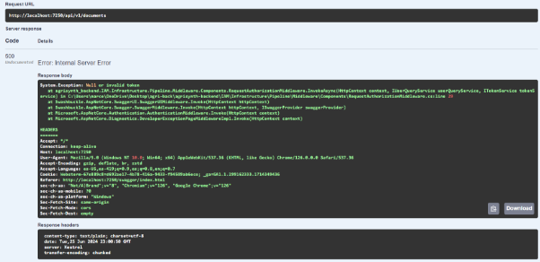
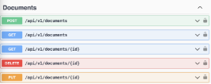

1. **Capítulo V: Product Implementation**
   1. **Software Configuration Management.**
      1. **Software Development Environment Configuration**

         A continuación, se ofrecerá una descripción detallada de cada uno de los productos de software utilizados en el proyecto. Esta sección será de gran ayuda para asegurar la colaboración efectiva de los desarrolladores actuales y futuros a lo largo de todo el proceso de desarrollo del proyecto.

         **Project Management**

- ` `Google Meet: <https://meet.google.com/> 

  Se utilizó Google Meet para llevar a cabo reuniones virtuales con los miembros del equipo y proporcionar una plataforma más eficaz para el intercambio de diferentes tipos de contenido, como la visualización conjunta de pantallas, así como la compartición de imágenes, texto y video. Google Meet es accesible desde aplicaciones web, dispositivos móviles y ordenadores de escritorio, ofreciendo una amplia compatibilidad en todas sus variantes. Para hacer uso de la aplicación es imprescindible contar con una cuenta activa.

- Trello: <https://trello.com/home> 

  Utilizamos Trello para la organización y seguimiento de las tareas pendientes, en proceso y completadas. Así se facilita la visibilidad del avance en el desarrollo de las diversas actividades que el equipo tiene en cola. Trello es una aplicación web que funciona con la mayoría de los navegadores actuales y su uso se inicia simplemente con el registro de una cuenta activa.

**Requirement Management**

- Trello: <https://trello.com/home> 

  Para la gestión de requisitos utilizamos Trello, una herramienta que facilita la colaboración en el backlog de forma colectiva y ofrece una interfaz de usuario intuitiva. Además, nos ayuda a tener claridad sobre las prioridades y la dirección estratégica del equipo. Trello es de uso gratuito, aunque es necesario crear una cuenta para poder acceder a sus servicios.

**Product UX/UI Design**

- Miro: <https://miro.com/es/> 

  Miro fue utilizado para la elaboración de los mapas de escenarios(as-is y to-be), proporcionando un enfoque detallado tanto para el mapeo general como para el específico de los segmentos de mercado objetivo. 

- UXpressia: <https://uxpressia.com/> 

  UXpressia nos permitió diseñar y desarrollar representaciones detalladas de nuestros usuarios ideales, ayudando al equipo a visualizar y comprender las necesidades, experiencias, comportamientos y objetivos de los distintos segmentos de nuestra audiencia.

- Figma: <https://www.figma.com/> 

  Figma resultó ser una herramienta esencial en el proceso de diseño, facilitando la elaboración colaborativa de wireframes y mockups.

**Software Development**

- Landing Page

  La landing page se creó utilizando tecnologías estándar como HTML5, CSS3 y JavaScript. Para optimizar la respuesta de diseño y acelerar el desarrollo, se eligió Bootstrap, un framework de CSS muy popular, por su eficiencia y facilidad de uso en la creación de interfaces web responsivas.

**IDE’S de desarrollo**

- **Visual Studio Code:** <https://code.visualstudio.com/> 

  Para la implementación de la landing page, se utilizó Visual Studio Code como el entorno de desarrollo integrado (IDE). Este IDE es ampliamente reconocido por su interfaz intuitiva y funcionalidades que potencian la productividad, como la edición de código, depuración y control de versiones, lo que facilita considerablemente el proceso de desarrollo web.

**Software Testing**

- **Google Lighthouse:  [Lighthouse (google.com)**](https://chromewebstore.google.com/detail/lighthouse/blipmdconlkpinefehnmjammfjpmpbjk)**

  Para verificar la calidad técnica del desarrollo de la landing page, emplearemos Google Lighthouse. Esta herramienta automatiza la evaluación del sitio, ofreciendo una visión clara del rendimiento del producto final. Google Lighthouse es una extensión gratuita compatible con los navegadores que admiten complementos de Google.

**Software Deployment**

- **Vercel: <https://vercel.com/>** 

  El despliegue de la landing page se facilitó mediante la integración del repositorio de GitHub con Vercel. Vercel simplifica el proceso de publicación automática del sitio con cada actualización que se sube al repositorio. Esta plataforma se destaca por su eficiencia en el despliegue continuo y por proporcionar un entorno optimizado para front-end, asegurando una entrega rápida y confiable del contenido web.

**Software Documentation**

- **Google Drive: [Google Drive**](https://www.google.com/intl/es-419_ALL/drive/start/apps.html)**

  Para la gestión inicial de la documentación del proyecto, recurrimos a Google Drive, utilizando específicamente Google Docs y Google Slides. Google Docs nos permitió crear y editar textos de manera colaborativa en tiempo real, mientras que Google Slides fue esencial para la preparación de presentaciones impactantes que resumieran nuestros hallazgos y estrategias. Estas herramientas de Google Drive favorecen la organización y el fácil acceso a la información, además de facilitar la colaboración simultánea de varios usuarios.

- **Lucidchart: <https://www.lucidchart.com>** 

  Utilizamos Lucidchart para crear diagramas UML, lo que nos permitió modelar con claridad la estructura y el diseño de nuestro software. Esta herramienta en línea brinda una plataforma intuitiva y colaborativa para la elaboración de diagramas complejos, facilitando la comunicación visual de las relaciones y procesos del sistema entre el equipo de desarrollo.

- **Structurizr: <https://structurizr.com/>** 

  Para los diagramas de arquitectura C4, elegimos Structurizr. Esta herramienta se especializa en representar la arquitectura de software de manera estructurada y abstracta, permitiéndonos definir y visualizar cómo se compone nuestro sistema en diferentes niveles, desde el nivel más alto de sistema hasta los componentes más detallados.

- **Vertabelo: <https://vertabelo.com/>** 

  En cuanto al diseño y la implementación de bases de datos, nos decantamos por Vertabelo. Esta plataforma de modelado de base de datos en la nube ofrece una interfaz gráfica para diseñar esquemas de bases de datos de manera eficiente, gestionar su estructura y generar el SQL necesario para su implementación, lo que simplificó significativamente este aspecto del proyecto.

1. **Source Code Management**

   Optamos por Github para el manejo de nuestra startup mediante una organización dentro de esta herramienta.

·      **Master Branch**

La Master Branch, también conocido como la rama master, es la rama principal del desarrollo de nuestro proyecto. Aquí se encuentra el desarrollo de la parte que estamos realizando actualmente.

Esta rama la denotamos como ***master***
**

·      **Develop Branch**

La Develop Branch, también conocida como la rama de desarrollo, es el entorno donde se ubican los cambios más recientes realizados por el nuestro equipo de desarrollo. Las actualizaciones realizadas en esta rama siempre serán entregadas en la versión que le sigue.

Esta rama tiene como notación ***develop*** y se crea con el comando el siguiente comando:

Comando de creación: ***gitcheckout -b develop master***

·      **Release Branch**

La Release Branch, también conocida como la rama de lanzamiento, nos permite desarrollar una nueva versión de la aplicación Task Management, al igual que subir las actualizaciones a la Develop Branch y, posteriormente a la Master Branch. En esta rama, también se corrigen los errores de las versiones anteriores.

Su notación es ***release*** y se crea con el siguiente comando:

Comando de creación: ***gitcheckout -b releasedevelop***

·  	**Feature Branch**

La Feature Branch, también conocida como la rama de características, se utiliza para implementar las últimas características y funcionalidades desarrolladas en la aplicación. Estas funcionalidades eventualmente serán implementadas a la Develop Branch.

Su notación es ***feature/[name of feature]*** y su comando de creación es el siguiente:

Comando de creación: ***gitcheckout -b feature/[name of feature]develop***

·      **Hotfix Branch**

La Hotfix Branch, también conocida como la rama de revisiones, se utiliza para solucionar posibles pequeños errores o problemas que, aunque no afectan mucho la experiencia de usuario, siguen siendo pequeños inconvenientes que pueden ser arreglados rápidamente. Esta rama permite solucionar pequeños errores mientras que el resto de los integrantes del equipo se mantienen trabajando en la siguiente versión de la aplicación. Es importante que el contenido de esta rama se derive posteriormente a la Master Branch.

Se denota como ***hotfix*** y su comando de creación es el siguiente:

Comando de creación***: gitcheckout -b hotfix master***

1. **Source Code Style Guide & Conventions**

   Para nuestro proyecto, hemos decidido seguir el Google HTML/CSS Style Guide([Google HTML/CSS Style Guide](https://google.github.io/styleguide/htmlcssguide.html)), garantizando así un código claro y coherente que se alinea con las mejores prácticas de la industria. Dentro de las convenciones de esta guía de estilo que adoptaremos se encuentran:

- Utilizar indentación de dos espacios para el HTML y el CSS, lo que contribuye a mantener la legibilidad sin aumentar excesivamente la indentación.
- Mantener la consistencia en la declaración de selectores de CSS, comenzando por los de tipo, seguidos de los ID y, finalmente, los de clase.
- Aplicar nombres descriptivos y breves para las clases, priorizando el guion bajo como separador para garantizar la claridad.
- Incluir comentarios específicos cuando sea necesario explicar el porqué detrás de reglas CSS particulares, especialmente si no son obvias a primera vista.

Para la escritura de código JavaScript en nuestro proyecto, seguiremos el Google JavaScript Style Guide([Google JavaScript Style Guide](https://google.github.io/styleguide/jsguide.html)). Esto asegurará que nuestro código sea uniforme y fácil de mantener. Algunas de las convenciones clave del estilo de Google que implementaremos incluyen:

- Emplear const para declarar variables que no se reasignarán, y let para variables que pueden cambiar, evitando el uso de var para mantener el alcance claro y predecible.
- Usar camelCase para nombrar variables, funciones y métodos, lo que facilita la lectura del código y su identificación.
- Colocar todas las declaraciones de variables al principio de la función o bloque para evitar errores relacionados con el hoisting.
- Limitar el uso de funciones anónimas; en su lugar, usar funciones con nombre para mejorar el stack trace y hacer el código más debuggable.
- Aplicar plantillas de cadena (template strings) para la concatenación, permitiendo una sintaxis más clara y la inclusión de expresiones.

1. **Software Deployment Configuration.**

En esta sección, nos ocuparemos de implementar nuestra página de inicio utilizando el servicio automatizado de Netlify. Con el fin de alcanzar este objetivo, detallaremos los pasos necesarios para realizar el despliegue de manera efectiva.

1. Vinculamos nuestra cuenta de Github a Vercel para darle acceso a todos nuestros repositorios y organizaciones

   

1. Creamos un proyecto importando el repositorio que contiene nuestra landing page

   

1. **Asignamos un nombre al proyecto, especificamos a vercel cual es la raíz de nuestra landing page y desplegamos.**

1. **Esperamos a que Vercel despliegue la página** 

   

1. **Obtenemos nuestra Landing Page desplegada un link para su visualización: [CropSphere (crop-sphere-landing-page.vercel.app)**](https://crop-sphere-landing-page.vercel.app/)**

   **

1. **Product Implementation & Deployment**
   1. **Sprint 1**
      1. **Sprint planning 1**

         A continuación, se detalla el sprint planning número uno, en el que se expondrán las pruebas de planificación y ejecución de la landing page. Además, se mostrarán los progresos del proyecto y los conocimientos adquiridos sobre la colaboración en equipo, obtenidos a través de la utilización de GitHub.

|Sprint#|Sprint 1|
| :- | :- |
|Sprint Planning Background||
|Date|Domingo 7 de abril del 2024|
|Time|19:00|
|Location|Videoconferencia Google Meet|
|Prepared By|AgriSynth Group|
|Attendees|Todo el equipo|
|
Sprint n - 0

Review Summary
|Al ser el primer sprint, no hay review summary previo.|
|
Sprint n - 1 

Retrospective Summary
|Durante este sprint, nuestro objetivo es desarrollar la landing page utilizando Bootstrap, un framework de estilos que es conocido por todos los miembros del equipo. También se discutirá y definirá el contenido textual de la página y se integrarán los diseños previamente realizados en Figma. Al concluir este sprint, la landing page se publicará mediante Vercel, permitiendo que cualquier usuario pueda acceder y ver la página utilizando el enlace correspondiente.|
|Sprint 1 Velocity|8|
|Sum of Story Points|8|

1. **Sprint Backlog 1**

En esta sección se presentan los tasks realizados durante el actual sprint, acompañadas de una captura del tablero correspondiente y el enlace al tablero en Trello.

**Link del Trello: <https://trello.com/invite/b/TivvG1aQ/ATTI1c57883ea5edd76b34566ceb3166bb584148822A/sprint-1-app-web>** 

<table><tr><th colspan="2" valign="top"><b>Sprint #</b></th><th colspan="5" valign="top"><b>Sprint 1</b></th></tr>
<tr><td colspan="2" valign="top"><b>User Story</b></td><td colspan="5" valign="top"><b>Work-item / Task</b></td></tr>
<tr><td>ID</td><td>Title</td><td>Id</td><td>Descripción</td><td>Estimación (horas)</td><td>Asignado a:</td><td>Status (pendiente/en proceso/en revisión/hecho)</td></tr>
<tr><td rowspan="2">US01</td><td rowspan="2">Implementación de Barra de navegación</td><td>T1</td><td valign="top">Implementar navbar con logo y diseño responsive</td><td>0\.5h</td><td>Mariana </td><td>hecho</td></tr>
<tr><td>T2</td><td valign="top">Implementar menú desplegable para las secciones</td><td>1h</td><td>Mariana</td><td>hecho</td></tr>
<tr><td rowspan="2">US02</td><td rowspan="2">Logo y Descripción de la Empresa</td><td>T3</td><td valign="top">Implementar hero section</td><td>1h</td><td>David</td><td>hecho</td></tr>
<tr><td>T4</td><td valign="top">Añadir diseño responsive para la hero section</td><td>1h</td><td>David</td><td>hecho</td></tr>
<tr><td rowspan="2">US02</td><td rowspan="2">Logo y Descripción de la Empresa</td><td>T5</td><td valign="top">Implementar about us section con información de visión y misión</td><td>0\.5h</td><td>Marcelo</td><td>hecho</td></tr>
<tr><td>T6</td><td valign="top">Añadir diseño responsive a la section</td><td>0\.5h</td><td>Marcelo</td><td>hecho</td></tr>
<tr><td rowspan="2">US03</td><td rowspan="2">Detalles y Servicios de la empresa</td><td>T7</td><td valign="top">Implementar sección de servicios con 4 ítems resumen.</td><td>1h</td><td>Marcelo</td><td>hecho</td></tr>
<tr><td>T8</td><td valign="top">Añadir diseño responsive.</td><td>2h</td><td>Marcelo</td><td>hecho</td></tr>
<tr><td rowspan="2">US04</td><td rowspan="2">Contacto con un asesor</td><td>T9</td><td valign="top">Implementar form de contacto</td><td>0\.5h</td><td>Piero</td><td>hecho</td></tr>
<tr><td>T10</td><td valign="top">Añadir diseńo responsive a la sección.</td><td>2h</td><td>Piero</td><td>hecho</td></tr>
<tr><td rowspan="2">US05</td><td rowspan="2">Descripción de Planes de suscripción</td><td>T11</td><td valign="top">Diseñar sección de planes que presenta plan asesor y corporativo</td><td>2h</td><td>Eduardo</td><td>hecho</td></tr>
<tr><td>T12</td><td valign="top">Implementar grids y tarjetas de cada plan</td><td>2h</td><td>Eduardo</td><td>hecho</td></tr>
<tr><td rowspan="2">US06</td><td rowspan="2">Compra de planes y suscripción</td><td>T13</td><td valign="top">Diseñar botón de compra dentro de los planes de suscripción</td><td>2h</td><td>Eduardo</td><td>hecho</td></tr>
<tr><td>T14</td><td valign="top">Vincular el botón hacia la aplicación web</td><td>2h</td><td>Eduardo</td><td>hecho</td></tr>
<tr><td rowspan="2">US07</td><td rowspan="2">Implementación de un footer</td><td>T15</td><td valign="top">Implementar footer section</td><td>0\.5h</td><td>Mariana</td><td>hecho</td></tr>
<tr><td>T16</td><td valign="top">Añadir diseño responsive</td><td>0\.5h</td><td>Mariana</td><td>hecho</td></tr>
</table>

1. **Development Evidence for Sprint Review.**

<table><tr><th valign="top"><b>Repository</b></th><th valign="top"><b>Branch</b></th><th valign="top"><b>Commit Id</b></th><th valign="top"><b>Commit Message</b></th><th valign="top"><b>Commit Message Body</b></th><th valign="top"><b>Committed on (Date)</b></th></tr>
<tr><td rowspan="9" valign="top">landing</td><td rowspan="9" valign="top">develop</td><td valign="top">eb02296eb30e22f79e816e1181c82622c51e564f</td><td valign="top">Initial commit</td><td valign="top"></td><td valign="top">11/04/2024</td></tr>
<tr><td valign="top">92c38ef84e51cc54f1716cc622579bede8b4f6ab</td><td valign="top">initial commit</td><td valign="top"></td><td valign="top">11/04/2024</td></tr>
<tr><td valign="top">c804ccb2e6f4f08cd40f9642f0756aad72b1c17b</td><td valign="top">add basic index template</td><td valign="top"></td><td valign="top">11/04/2024</td></tr>
<tr><td valign="top">3b9f05453e5c1f15ece59b07ef1ec5a6e8b4b910</td><td valign="top">add t1 and t2</td><td valign="top"></td><td valign="top">11/04/2024</td></tr>
<tr><td valign="top">842b2a4f3080fd3149bfbd6dde5e242c4ea77205</td><td valign="top">feat: add section home to landing</td><td valign="top"></td><td valign="top">11/04/2024</td></tr>
<tr><td valign="top">cc50b26257ab0213f38ee474f0888d713291a887</td><td valign="top">IMPLEMENTED US05, US06, US08 ON THE LANDING PAGE</td><td valign="top"></td><td valign="top">11/04/2024</td></tr>
<tr><td valign="top">37bacb7b604ef1f2b94c9a76945a448e0a195201</td><td valign="top">
Add: User Story 4 Landing page

</td><td valign="top"></td><td valign="top">11/04/2024</td></tr>
<tr><td valign="top">8107fca1336b3e72ffbc497f63a759311998a79e</td><td valign="top">test: add subscription section from US06</td><td valign="top"></td><td valign="top">11/04/2024</td></tr>
<tr><td valign="top">014b64f5e077f05e8debd452b345a7ec9ca21b5b</td><td valign="top">fix: indentation and add footer</td><td valign="top"></td><td valign="top">11/04/2024</td></tr>
</table>

1. **Testing Suite Evidence for Sprint Review**

<table><tr><th valign="top"><b>Repository</b></th><th valign="top"><b>Branch</b></th><th valign="top"><b>Commit Id</b></th><th valign="top"><b>Commit Message</b></th><th valign="top"><b>Commit Message Body</b></th><th valign="top"><b>Commited on (Date)</b></th></tr>
<tr><td rowspan="11" valign="top">
upc-pre-202401-si730-sw53-agrisynth-repor[t](https://github.com/upc-pre-202401-si730-sw53-agrisynth/upc-pre-202401-si730-sw53-agrisynth-report)

</td><td rowspan="11" valign="top">main</td><td valign="top">ecc98d18a139f3a1470a76ce3ca2a1eb78a1892d</td><td valign="top">Doc: Added chapters</td><td valign="top"></td><td valign="top">10/04/2024</td></tr>
<tr><td valign="top">7345794f623f6e0ff2bd8d1ae9a720c432f2f7ae</td><td valign="top">Doc: Update CAPITULO IV</td><td valign="top">Added Landing Page UI Design and 4.5 Web Applications Prototyping</td><td valign="top">10/04/2024</td></tr>
<tr><td valign="top">c55884c54ccd25cfa80fb7e36f6ab44f6558ff46</td><td valign="top">doc: add chapter 1</td><td valign="top"></td><td valign="top">10/04/2024</td></tr>
<tr><td valign="top">a9c64dd233d4cf4edca0a6cdb45759f91da5c6f6</td><td valign="top">fix: corrección doc chapter 1</td><td valign="top"></td><td valign="top">11/04/2024</td></tr>
<tr><td valign="top">57a088620ec5ee8856f1757bb8b38564d2bcd984</td><td valign="top">doc: add chapter 2 from 2.1 to 2.2.1</td><td valign="top"></td><td valign="top">11/04/2024</td></tr>
<tr><td valign="top">dd989523cd612e9f40696921917357cc59bfc21c</td><td valign="top">docs: add team names</td><td valign="top"></td><td valign="top">11/04/2024</td></tr>
<tr><td valign="top">93594a7fc34d90d128ba3c0cce12be97e8bf275c</td><td valign="top">doc: add more items from chapter 2</td><td valign="top"></td><td valign="top">11/04/2024</td></tr>
<tr><td valign="top">5cedc9a2998dc0934720f42e050edc8f38f608f0</td><td valign="top">doc: start writing chapter 3</td><td valign="top"></td><td valign="top">11/04/2024</td></tr>
<tr><td valign="top">879dba95315c360326abc434862dccc624d97726</td><td valign="top">doc: add more items in chapter 4</td><td valign="top"></td><td valign="top">11/04/2024</td></tr>
<tr><td valign="top">628935d7808558c657d97c3c1a2957563b7c18fc</td><td valign="top">feat: add and complete the chapter 4</td><td valign="top"></td><td valign="top">11/04/2024</td></tr>
<tr><td valign="top">f5acd29ce449a784ac4fd5836d4c7a7d8f73fcb0</td><td valign="top">Added the Users Stories and Product Backlog</td><td valign="top"></td><td valign="top">11/04/2024</td></tr>
</table>

1. **Execution Evidence for Sprint Review**

   Para esta entrega nuestra startup AgriSynth trabajó en conjunto para el diseño e implementación de la landing page de nuestro producto de software, la cual se centra en la conversación de usuario a cliente, a través de información acerca de nuestro proyecto, los servicios que ofrece y un formulario de contacto directo.

1. **Services Documentation Evidence for Sprint Review.**

El objetivo del primer sprint fue realizar la landing page, por lo tanto aún no se encuentra evidencia del uso de web services.

1. **Software Deployment Evidence for Sprint Review.**

En nuestro primer sprint, concluimos con la creación de nuestra landing page. Las herramienta que se usaron para llevar a cabo esta tarea fueron:

- Git: Un sistema de control de versiones que facilitó la colaboración en la construcción de la página de inicio.
- GitFlow: Un modelo de procesos para gestionar el progreso individual en el desarrollo de la página de inicio.
- GitHub: Una plataforma que sirvió para el desarrollo en equipo, permitiendo almacenar las distintas versiones del proyecto.
- Vercel: Una plataforma destinada a la automatización del alojamiento y lanzamiento de la página de inicio en entornos estáticos.

1. **Team Collaboration Insights during Sprint**

![ref1]

1. **Sprint 2**
   1. **Sprint Planning 2.**

|Sprint#|Sprint 2|
| :- | :- |
|Sprint Planning Background||
|Date|Domingo 23 de abril del 2024|
|Time|19:00|
|Location|Remoto vía Discord|
|Prepared By|AgriSynth Group|
|Attendees|Todo el equipo|
|
Sprint n - 0

Review Summary
|La página de inicio fue exitosamente lanzada con Vercel, sin embargo, no se implementan las funcionalidades de cambio de idioma ni la sección de términos y condiciones. Estos elementos se abordarán en el sprint actual.|
|
Sprint n - 1 

Retrospective Summary
|Para este sprint, se avanza en el desarrollo del front-end de la aplicación web, añadiendo vistas para la autenticación de usuarios y vistas principales para usuarios reclutadores. También se incluirá la configuración multilingüe utilizando la librería i18n en Vue. Además, se tiene previsto elaborar las secciones de términos de servicio y vídeos sobre el producto y el equipo. Hemos organizado las tareas a través de Trello. Al concluir este sprint, esperamos que la página de inicio esté actualizada y que se disponga de una demostración funcional de la aplicación web desplegada en Netlify, aunque los datos solo se mostrarán cuando el servidor json esté en ejecución.|
|Sprint 1 Velocity|8|
|Sum of Story Points|8|

1. **Sprint Backlog 2.**

|**Sprint #**|**Sprint 2**||||||
| :- | :- | :- | :- | :- | :- | :- |
|**User Story**|**Work-item / Task**||||||
|ID|Title|Id|Descripción|Estimación (horas)|Asignado a:|Status (pendiente/en proceso/en revisión/hecho)|
|EP1 / US01|Registro de un nuevo usuario|T1|Implementar un sistema de registro de usuario|4H|Marcelo |hecho|
|EP1 / US02|Acceso de usuarios|T2|Implementar un sistema que permita a los usuarios ingresar al sistema|4H|Marcelo|hecho|
|EP1 / US03|Recuperación de Contraseña|T3|Implementar un sistema que permita al usuario recuperar su contraseña, en caso la pierda|4H|Marcelo|hecho|
|EP2 / US01|Creación de un recurso|T4|Permitir al usuario crear un recurso en la aplicación, para que pueda hacer un seguimiento del mismo|8H|David|hecho|
|EP3 / US03|Edición de un recurso|T7|Implementar un sistema que permita al usuario que editar un recurso que ha creado|4H|Mariana|hecho|
|EP3 / US02|Borrado de recurso|T8|Implementar un sistema que permita al usuario borrar un recurso en caso ya no lo utilice|4H|David|hecho|
|EP4 / US01|Visualizar detalles de Maquinaria|T9|Implementar un dialog de primevue que muestre información detallada de la maquinaria seleccionada|4H|Mariana|hecho|
|EP4 / US02|Visualizar detalles de Terrenos|T10|Implementar dialog de primevue que muestre información más detallada de los terrenos|6H|Piero|hecho|
|EP4 / US03|Alquiler y Compra de Maquinaria o Terreno|T11|Implementar formulario con datos pertinentes a la compra.|8H|
Piero /

Mariana
|hecho|
|EP05 / US01|Visualización de Estadísticas de Recursos|T12|Implementar vista de estadística que toma como datos el historial de precios de un producto|8H|David|hecho|
|EP5 / US02|Comparación de Precios de Terrenos y Maquinaria|T13|Implementar tabla que compare precios de terrenos según su selección.|8H|David|hecho|
|EP06 / US01|Creación de grupo de Trabajo|T14|Implementar un dialog que permita el post dentro del db.json|8H|Eduardo|hecho|
|EP06 / US02|Agregar personas al grupo|T15|Implementar botón add member que asigne al grupo.|5H|Eduardo|hecho|
|EP06 / US03|Visualizar los integrantes del grupo|T16|Implementar tabla que cree grupos y muestre integrantes.|4H|Eduardo|hecho|
|EP06 / US04|Eliminar personas del grupo|T17|Implementar un botón que elimine el member dentro del grupo.|4H|Eduardo|hecho|
|EP08 / US02|Ajuste de Datos Personales|T22|Implementar un sistema que permita cambiar sus datos personales|4H|Marcelo|hecho|
|EP08 / US03|Cambio de contraseña|T23|Implementar un sistema que permita al usuario cambiar su contraseña registrada|4H|Marcelo|hecho|

1. **Development Evidence for Sprint Review.**

Repositorio en Github: 

<table><tr><th valign="top"><b>Repository</b></th><th valign="top"><b>Branch</b></th><th valign="top"><b>Commit Id</b></th><th valign="top"><b>Commit Message</b></th><th valign="top"><b>Commit Message Body</b></th><th valign="top"><b>Committed on (Date)</b></th></tr>
<tr><td rowspan="20" valign="top">agrisynth-frontend</td><td rowspan="20" valign="top">DEVELOP</td><td valign="top">efc759fd8fd6b85f5ed5e292caac01995edc48eb</td><td valign="top">chore: add the first structure</td><td valign="top">None</td><td valign="top">Apr 26, 2024</td></tr>
<tr><td valign="top">324e3926c7f11341d1f0b438dc4ee5dc36fd420f</td><td valign="top">docs: update the README.md</td><td valign="top">None</td><td valign="top">Apr 26, 2024</td></tr>
<tr><td valign="top">318b8e5632d2eb7fd636436f2f83cc04929c571e</td><td valign="top">feat: add dependencies</td><td valign="top">None</td><td valign="top">Apr 27, 2024</td></tr>
<tr><td valign="top">5b829a23ff93a32409e56ab1ac24bcb4290750fa</td><td valign="top">
add: terrain-card component , terrain.entity and terrain.api created

</td><td valign="top">None</td><td valign="top">Apr 27, 2024</td></tr>
<tr><td valign="top">b22532731f262640eae3539e08fdeb8de06662a4</td><td valign="top">update: terrain list component added</td><td valign="top">None</td><td valign="top">Apr 27, 2024</td></tr>
<tr><td valign="top">2a65ff400e389d974de6e4a9e972faa40553a52a</td><td valign="top">
update: components

</td><td valign="top">
The terrain-card and terrain-list components were updated, and also terrain.entity

</td><td valign="top">Apr 28, 2024</td></tr>
<tr><td valign="top">21886ba7edf1df2baab739950d7e1251888fb119</td><td valign="top">
add: dialog boxes added

</td><td valign="top">The description, processing and payment dialog box was added for each terrain-card</td><td valign="top">Apr 28, 2024</td></tr>
<tr><td valign="top">170ef82c47dd336eb43c480def307f395d54860e</td><td valign="top">update: css update</td><td valign="top">None</td><td valign="top">Apr 29, 2024</td></tr>
<tr><td valign="top">f471b66a985dbd0eb0e25fe80022e6125214ba53</td><td valign="top">update: language component changed</td><td valign="top">None</td><td valign="top">Apr 29, 2024</td></tr>
<tr><td valign="top">f21b3d3354bcf66ebfe835766d5e21f05305f4e4</td><td valign="top">update: input text dialog updated</td><td valign="top">None</td><td valign="top">Apr 30, 2024</td></tr>
<tr><td valign="top">f3021cc5f3c226953fcd6e71efebec6750dc66df</td><td valign="top">update: api updated</td><td valign="top">None</td><td valign="top">Apr 30, 2024</td></tr>
<tr><td valign="top">fd2e33829cd07e92678ec73b5b2acf911dd60b81</td><td valign="top">
update: terrain-list component

</td><td valign="top">None</td><td valign="top">May 3, 2024</td></tr>
<tr><td valign="top">fd2dffd132a9af032004076b2416248dbefbf3d9</td><td valign="top">update: update index.js</td><td valign="top">None</td><td valign="top">May 3, 2024</td></tr>
<tr><td valign="top">52d87190a9249a8b4536147c44c7dae47a76e4d1</td><td valign="top">Update terrain-list.component.vue</td><td valign="top">None</td><td valign="top">May 3, 2024</td></tr>
<tr><td valign="top">b633ed9b0f5afb10c485988f732c355f1b0a02a7</td><td valign="top">
Merge pull request #3 from upc-pre-202401-si730-sw53-agrisynth/feature/terrains

</td><td valign="top">
Feature/terrains

</td><td valign="top">May 3, 2024</td></tr>
<tr><td valign="top">8db9a2e590c8e733cb1024bab7fdc6fb04d294cb</td><td valign="top">feat: add the view resources with components</td><td valign="top">None</td><td valign="top">May 3, 2024</td></tr>
<tr><td valign="top">16d05deee4c300ed24f8d4a023c7b8736e1b5b2e</td><td valign="top">
Merge pull request #4 from upc-pre-202401-si730-sw53-agrisynth/feature/resources

</td><td valign="top">feat: add the view resources with components</td><td valign="top">May 3, 2024</td></tr>
<tr><td valign="top">fb8e7b907c86952b684e1e755abde7cbcee48624</td><td valign="top">
feat: add the page machinerys with components

</td><td valign="top">None</td><td valign="top">May 3, 2024</td></tr>
<tr><td valign="top">7bdbaf0789c6d4454f2897dbd4018e34d1f52a51</td><td valign="top">
Merge pull request #6 from upc-pre-202401-si730-sw53-agrisynth/feature/machinerys

</td><td valign="top">
feat: add the page machinerys with components

</td><td valign="top">May 3, 2024</td></tr>
<tr><td valign="top">9b466dea93637ddb1bb641e54aa5727524df2a7b</td><td valign="top">
feat(add): implement feature collaboration in the sidenav bar

</td><td valign="top">None</td><td valign="top">May 3, 2024</td></tr>
<tr><td valign="top"></td><td valign="top"></td><td valign="top">a4c82a538edba990dc889ab448bef6299bb48224</td><td valign="top">
feat(add): implement css in collaboration page

</td><td valign="top">None</td><td valign="top">May 3, 2024</td></tr>
<tr><td valign="top"></td><td valign="top"></td><td valign="top">2d540eeb5a00140ee6429ee0a2577648f1668154</td><td valign="top">
Merge pull request #7 from upc-pre-202401-si730-sw53-agrisynth/feature/collaboration

</td><td valign="top">
Feature/collaboration

</td><td valign="top">May 3, 2024</td></tr>
<tr><td valign="top"></td><td valign="top"></td><td valign="top">262c01186cf7763c6ac0f93a66202e19a46610d4</td><td valign="top">
feat: added authentications, configuration and support pages

</td><td valign="top">None</td><td valign="top">May 3, 2024</td></tr>
<tr><td valign="top"></td><td valign="top"></td><td valign="top">af673e2aa5d217e23ca4e01b577b5508ae65567f</td><td valign="top">
Merge pull request #8 from upc-pre-202401-si730-sw53-agrisynth/feature/authentication

</td><td valign="top">
feat: added authentications, configuration and support pages

</td><td valign="top">May 3, 2024</td></tr>
</table>

1. **Testing Suite Evidence for Sprint Review.**

En el alcance del sprint 2 se ha desarrollado el frontend de la aplicación web por lo que no se evidencia testing.

1. **Execution Evidence for Sprint Review.**

En este sprint logramos como primera fase de nuestro producto final, desarrollar nuestra aplicación web usando Vue y PrimeVue, en conjunto con una API hecha con JSON server. 

Muestra de todas  vistas programadas en Vue para este sprint: 

- Pantalla de Login

  

- Pantalla de Register

  

- Dashboard o pantalla de Terrains

  

- Pantalla de Resource Management

  

- Pantalla de Machineries

  

- Pantalla de Group

  

- Pantalla de Suport and help

  

- Pantalla de settings

  

  - Muestra de la respuesta de nuestra API hecha con JSON server: 

Enlace del video: 

1. **Services Documentation Evidence for Sprint Review.**

Para este sprint utilizamos los servicios básicos Http en conjunto con Json server que facilitó la construcción de nuestra fake api.

Nuestras variable de entorno serverBasePath que apuntará al puerto 3000:

Nuestra clase BaseService

Un ejemplo usando un endpoint:

1. **Software Deployment Evidence for Sprint Review.**

Creamos un nuevo site desde un proyecto existente en Github

Instalamos Netlify en nuestra organización de Github

Damos acceso a todos nuestros repositorios de nuestra organización.

Seleccionamos el repositorio del que queremos hacer el new site

seleccionamos nuestra rama de la que queremos que haga el build

esperamos y tenemos el link de nuestro aplicación web desplegueda.

1. **Team Collaboration Insights for Sprint Review**

Durante este sprint, al igual que para el desarrollo de la landing page, para proteger la rama “main” creamos una rama “develop” de la que cada integrante de nuestro grupo creó su propia sub-rama “feature“ para subir un capítulo del reporte siguiendo las convenciones antes señaladas(conventional commit y git flow).
(img de las ramas)

![ref1]
1. **Sprint 3**
   1. **Sprint Planning 3.**

|Sprint#|Sprint 3|
| :- | :- |
|Sprint Planning Background||
|Date||
|Time||
|Location|Remoto vía Discord|
|Prepared By|AgriSynth Group|
|Attendees|Todo el equipo|
|
Sprint n - 2

Review Summary
|Se desarrolló las vistas de nuestra aplicación web que faltaban, sin olvidar que tuvimos que reestructurar algunas partes del informe.|
|
Sprint n - 3 

Retrospective Summary
|Se planea terminar de desarrollar todo el frontend de la aplicación, mejorar algunos features mediante el uso de params y queries, empezar con el proceso de construcción  de la aplicación de la API hecha con C# .NetCore y finalmente implementar un CRUD.|
|Sprint 1 Velocity||
|Sum of Story Points||

1. **Sprint Backlog 3.**

|**Sprint #**|**Sprint 3**||||||
| :- | :- | :- | :- | :- | :- | :- |
|**User Story**|**Work-item / Task**||||||
|ID|Title|Id|Descripción|Estimación (horas)|Asignado a:|Status (pendiente/en proceso/en revisión/hecho)|
|EP1 / US01|Registro de un nuevo usuario|T1|Implementar un sistema de registro de usuario|4H|Marcelo |hecho|
|EP1 / US02|Acceso de usuarios|T2|Implementar un sistema que permita a los usuarios ingresar al sistema|4H|Marcelo|hecho|
|EP2 / US01|Creación de un recurso|T4|Permitir al usuario crear un recurso en la aplicación, para que pueda hacer un seguimiento del mismo|8H|David|hecho|
|EP4 / US01|Visualizar detalles de Maquinaria|T9|Implementar un dialog de primevue que muestre información detallada de la maquinaria seleccionada|4H|Mariana|hecho|
|EP4 / US02|Visualizar detalles de Terrenos|T10|Implementar dialog de primevue que muestre información más detallada de los terrenos|6H|Piero|hecho|
|EP05 / US01|Visualización de Estadísticas de Recursos|T12|Implementar vista de estadística que toma como datos el historial de precios de un producto|8H|David|hecho|
|EP06 / US01|Creación de grupo de Trabajo|T14|Implementar un dialog que permita el post dentro del db.json|8H|Eduardo|hecho|
|EP06 / US02|Agregar personas al grupo|T15|Implementar botón add member que asigne al grupo.|5H|Eduardo|hecho|
|EP06 / US03|Visualizar los integrantes del grupo|T16|Implementar tabla que cree grupos y muestre integrantes.|4H|Eduardo|hecho|

1. **Development Evidence for Sprint Review.**

Repositorio en Github: 

|**Repository**|**Branch**|**Commit Id**|**Commit Message**|**Commit Message Body**|**Committed on (Date)**|
| :- | :- | :- | :- | :- | :- |
|agrisynth-frontend|develop|91cd86bc9195cdb6934461983e3ad736e82902ab|feat(style): update components styles|none|2/6/2024|
|agrisynth-frontend|develop|6ad37da864a2ffc2a39a6f4f7c9a10fa9556b05d|feat: add padding an margin to terrain-card.component.vue|none|3/6/2024|
|agrisynth-frontend|develop|22c4a55580d05e2a26205e86a1a1e0589f4bdd36|refactor: changed code structure|Changed the structure in most of the project files|8/6/2024|
|agrisynth-frontend|main|91cd86bc9195cdb6934461983e3ad736e82902ab|feat(style): update components styles|none|2/6/2024|
|agrisynth-frontend|main|99bddbaf9003150a0675d30beb23c7e233bd45f3|Merge pull request #17 from upc-pre-202401-si730-sw53-agrisynth/develop|develop|2/6/2024|
|agrisynth-frontend|main|6ad37da864a2ffc2a39a6f4f7c9a10fa9556b05d|feat: add padding an margin to terrain-card.component.vue|none|3/6/2024|
|agrisynth-frontend|main|22c4a55580d05e2a26205e86a1a1e0589f4bdd36|refactor: changed code structure|Changed the structure in most of the project files|8/6/2024|
|agrisynth-frontend|main|73451f8922fa34dbe3ae63df82f3808b18f3db51|Merge pull request #18 from upc-pre-202401-si730-sw53-agrisynth/develop|develop|8/6/2024|
|agrisynth-backend|develop|6466afa5a67ec40380614d9c06f68d1c781980a9|chore: initial structure.|none|5/6/2024|
|agrisynth-backend|develop|55b9857316799e556df7b943131d3b5c54888888|chore: update gitignore|none|5/6/2024|
|agrisynth-backend|develop|55b9857316799e556df7b943131d3b5c54888888|Delete .idea/.idea.agrisynth-backend/.idea directory|none|5/6/2024|
|agrisynth-backend|develop|3a59efd313567f4020d9825a610088cad43708f7|chore: update gitignore.|none|5/6/2024|
|agrisynth-backend|develop|b2e2d6e6d2dcebf997ceb76a8b0d01bde7873a68|Merge remote-tracking branch 'origin/main'|none|5/6/2024|
|agrisynth-backend|develop|41200f97ce55f7a382d481096bc0f7c78a8e4d0c|feat: add feature terrain rent|none|5/6/2024|
|agrisynth-backend|develop|7cdd182266a662da179ce09d761c6fb435833515|feat: Collaboration bounded context|none|5/6/2024|
|agrisynth-backend|develop|7e54843547db9809948ac5da155215c1b37d6ccd|Merge pull request #1 from upc-pre-202401-si730-sw53-agrisynth/feature/collaboration|Feature/collaboration|5/6/2024|
|agrisynth-backend|develop|10e59e3f7ca38cae2f3c0666213d52ba4cd260c7|feat: add program.cs configuration|none|5/6/2024|
|agrisynth-backend|develop|8d70e903ce120c512187f55c0ec56b74eb0e76fe|Feat: set collaboration bounded context|none|5/6/2024|
|agrisynth-backend|develop|295e22206a33cccdd76422ef297bb4fde282ae92|Merge pull request #6 from upc-pre-202401-si730-sw53-agrisynth/feature/collaboration|Feature/collaboration|5/6/2024|
|agrisynth-backend|develop|cf1b02fa9af447a52b7fbe7215b24360517a09ed|feat: add updates to commandservices and queryservices|none|6/6/2024|
|agrisynth-backend|develop|a355de71c3352b374c162b253f5c18f1698f8999|feat: add domain layer including model, repositories and services|none|6/6/2024|
|agrisynth-backend|develop|df90ec6ff1c01df37c3c265ced42cb00aca53cd4|feat: add interfaces with resources and MachinerysController|none|6/6/2024|
|agrisynth-backend|develop|cf982ee9e57b4bbebaa3a4a9f86a3b4f1b560355|feat: add the machinerys context|none|6/6/2024|
|agrisynth-backend|develop|689fb89548de46dc029b3f377289131b2cd22923|feat: add the machinerys files|none|6/6/2024|
|agrisynth-backend|develop|910da483b3fe3920e7dc804051d344fa398566c9|Merge pull request #7 from upc-pre-202401-si730-sw53-agrisynth/feature/machineryRent|feature/machinery rent|6/6/2024|
|agrisynth-backend|develop|d24270906f43a4f3aecb671dc9bc4d68ad632ecf|feat: add domain layer and application command and query services|none|6/6/2024|
|agrisynth-backend|develop|8f084d3462e04a547aff37324d114e5ad85192f4|feat: add infrastructure and interfaces CRUD|none|7/6/2024|
|agrisynth-backend|develop|762fb8ebbd60d2de5ad817c60df50e707e3717d8|feat: add the updateDocumentCommand|none|7/6/2024|
|agrisynth-backend|develop|69a97aefe6bff59c61281880eedc36b281c492ba|feat: add the resource items bounded context and modified the AppDbContext|none|8/6/2024|
|agrisynth-backend|develop|41d1b2b0d6cac8f8923582973bf3964263d5ec41|feat(profiles): added profiles bc|none|8/6/2024|
|agrisynth-backend|develop|d9d05dc7d23d5ea993821bbf8959461676eeb3fa|feat: update protocols|feat: update protocols|9/6/2024|

1. **Testing Suite Evidence for Sprint Review.**

En el alcance del sprint 3 se ha desarrollado el frontend de la aplicación web por lo que no se evidencia testing.

|**Repository**|**Branch**|**Commit Id**|**Commit Message**|**Commit Message Body**|**Committed on (Date)**|
| :- | :- | :- | :- | :- | :- |
|||||||
** 

1. **Execution Evidence for Sprint Review.**

En este sprint logramos como tercera fase de nuestro producto final, desarrollar la API hecha con C# y Microsoft .NET Framework . 

`		`Muestra de nuestra API hecha con .NET Framework:

video que ilustra y explica la visualización y navegación logrados en este Sprint:

1. **Services Documentation Evidence for Sprint Review.**

Para este sprint utilizamos los servicios de la API que nosotros mismos hicimos utilizando el lenguaje C# y Microsoft .NET Framework. A continuación, mostramos todos los endpoints realizados por nuestro equipo por cada Bounded Context correctamente documentado en Swagger.

Repositorio del backend en github: 

<https://github.com/upc-pre-202401-si730-sw53-agrisynth/agrisynth-backend> 

|**Bounded Context**|Documents||
| :- | :- | :- |
|**Entity**|**Endpoint URL**|**Swagger**|
||api/v1/documents/||

|**Bounded Context**|Machinerys||
| :- | :- | :- |
|**Entity**|**Endpoint URL**|**Swagger**|
||api/v1/machinerys/||

|**Bounded Context**|Teams||
| :- | :- | :- |
|**Entity**|**Endpoint URL**|**Swagger**|
||api/v1/Teams/||

|**Bounded Context**|TeamWorkers||
| :- | :- | :- |
|**Entity**|**Endpoint URL**|**Swagger**|
||api/v1/team-workers/||

|**Bounded Context**|Terrains||
| :- | :- | :- |
|**Entity**|**Endpoint URL**|**Swagger**|
||api/v1/terrains/||

|**Bounded Context**|Workers||
| :- | :- | :- |
|**Entity**|**Endpoint URL**|**Swagger**|
||api/v1/workers/||

|**Bounded Context**|Profiles||
| :- | :- | :- |
|**Entity**|**Endpoint URL**|**Swagger**|
||api/v1/profiles/||

|**Bounded Context**|ResourceItems||
| :- | :- | :- |
|**Entity**|**Endpoint URL**|**Swagger**|
||api/v1/resource-items/||

1. **Software Deployment Evidence for Sprint Review.**

Entrar a Netlify y presionar la opción de “Import an existing project”

Después seleccionar la opción de “Deploy con github”

Tras haber hecho eso tenemos que seleccionar nuestra organización y dentro de ella buscar el repositorio del proyecto “**AgriSynthGroup-backend**” que deseamos subir a producción

Para finalmente agregar la data necesaria para el despliegue

Y final solo presionar el botón con el nombre de proyecto a desplegar

\-       Link de la Landing page:<https://upc-pre-202401-si730-sw53-agrisynth.github.io/agrisynth-landing-page/> 

1. **Team Collaboration Insights for Sprint Review**

Durante este sprint, al igual que para el desarrollo de la landing page, frontend y backend, para proteger la rama “main” creamos una rama “develop” de la que cada integrante de nuestro grupo creó su propia sub-rama “feature“ para subir un capítulo del reporte siguiendo las convenciones antes señaladas(conventional commit y git flow).

**Github analytics de nuestro tercer sprint:** 

1. **Sprint 4**

En esta sección se registra y explica el avance en términos de producto y trabajo colaborativo para el Sprint 4, enfocado en la implementación completa de la aplicación web, la API RESTful, los Web Services y la landing page. Además, se finalizó el desarrollo de todo el backend de los Web Services. Se detalla el progreso tangible y funcional de cada componente, incluyendo su diseño, desarrollo y funcionalidades implementadas. También se documenta la colaboración del equipo, los métodos de comunicación utilizados y las herramientas empleadas para garantizar una cooperación efectiva. Incluye secciones sobre la planificación del sprint, el backlog de tareas, evidencia del desarrollo y ejecución, documentación de servicios utilizados y reflexiones sobre la colaboración del equipo, proporcionando una visión completa del progreso alcanzado.

1. **Sprint Planning 4.**

En este sprint planning 4 se presenta la evidencia de la planificación para la implementación de la Application Web, RESTful API  y landing page. Además, se evidenciaron los avances del proyecto e insights de colaboración en el equipo a través de GitHub.

|Sprint#|Sprint 4|
| :- | :- |
|Sprint Planning Background||
|Date|Martes 25 de junio del 2024|
|Time|17:00|
|Location|Remoto vía Discord|
|Prepared By|AgriSynth Group|
|Attendees|Todo el equipo|
|
Sprint n - 3

Review Summary
|Se planea terminar de desarrollar todo el frontend de la aplicación, mejorar algunos features mediante el uso de params y queries, empezar con el proceso de construcción  de la aplicación de la API hecha con C# .NetCore y finalmente implementar un CRUD.|
|
Sprint n - 4 

Retrospective Summary
|Se planea acabar con todas las operaciones definidas en los technical stories además de implementar el bounded context de autenticación(IAM). Finalmente conectar el API con el frontend.|
|Sprint 4 Velocity|8|
|Sum of Story Points|8|

1. **Sprint Backlog 4.**

En esta parte mostramos las tareas que se realizaron en este sprint.

Link del Trello:

<https://trello.com/invite/b/2qhQ3v57/ATTI2ec4b2ab56c2a23dbc12fa13ca2e554dDE9C5C1F/sprint-backlog-4> 

Vista del Sprint Backlog 4 en Trello

|**Sprint #**|**Sprint 4**||||||
| :- | :- | :- | :- | :- | :- | :- |
|**User Story**|**Work-item / Task**||||||
|ID|Title|Id|Descripción|Estimación (horas)|Asignado a:|Status (pendiente/en proceso/en revisión/hecho)|
|
EP04   /

US04
|Edicion de un Documento|T8|Conectar el endpoint correspondiente para editar documentos e implementar los métodos GET,POST,PUT y DELETE.|3H|Mariana|Hecho|
|EP06 / US02|Agregar personas al grupo|T5|Conectar el endpoint para agregar personas a un grupo e implementar el método POST, validando la existencia de la persona y el grupo, y gestionando permisos y roles.|4H|Eduardo|Hecho|
|EP08 / US03|Cambio de contraseña|T7|Implementar funcionalidad en la sección de settings|2H|Marcelo|Hecho|
|EP4 / US02|Visualizar detalles de Terrenos|T2|Conectar el endpoint correspondiente e implementar el método GET para obtener detalles de terrenos, gestionando permisos para acceso autorizado.|4H|Piero|Hecho|
|EP3 / US03|Edición de un recurso|T3|Conectar el endpoint correspondiente para editar recursos e implementar los métodos GET y PUT.|4H|Natanael|Hecho|
|EP3 / US02|Borrado de recurso|T4|Conectar el endpoint correspondiente e implementar el método DELETE.|4H|Natanael|Hecho|
|EP1 / US02|Acceso de usuarios|T1|Conectar el endpoint correspondiente e implementar el método POST para login de usuarios, validando credenciales y gestionando tokens de sesión.|8H|Marcelo|Hecho|
|EP06 / US01|Creación de grupo de Trabajo|T9|Conectar el endpoint correspondiente e implementar el método POST para crear grupos de trabajo.|4H|Eduardo|Hecho|
|
EP04 /   

US05
|Eliminar O Descargar un Documento|T10|Conectar el endpoint correspondiente e implementar los métodos DELETE y GET (para descargar documentos), con validaciones y manejo de permisos|5H|Mariana|Hecho|

1. **Development Evidence for Sprint Review.**

En esta sección incluiremos el registro de los últimos commits realizados en las ramas main y develop respectivamente de los repositorios de nuestra landing page, web application y API en Github.

**Nuestros repositorios:**

- **Landing page: <https://github.com/upc-pre-202401-si730-sw53-agrisynth/agrisynth-landing-page>** 
- **Web application: <https://github.com/upc-pre-202401-si730-sw53-agrisynth/agrisynth-frontend>** 
- **RESTful API: <https://github.com/upc-pre-202401-si730-sw53-agrisynth/agrisynth-backend>** 

|**Repository**|**Branch**|**Commit Id**|**Commit Message**|**Commit Message Body**|**Committed on (Date)**|
| :- | :- | :- | :- | :- | :- |
|agrisynth-frontend|develop|959a92b58d64f409fd2f3e64ceece52781145b9e|feat(iam): added iam component|none|22/06/24|
|agrisynth-frontend|develop|257ff8db8cd1f360e79f4b0e9e3fd27c47271e88|fix: changed connection with backend|none|23/06/24|
|agrisynth-frontend|develop|c990a758f8cfa48073c434fd80e0138436d8c13d|fix(iam): fixed issues that prevented connection|none|25/06/24|
|agrisynth-frontend|develop|dcddf88fed1183a6f44c7002df2466cd6c0ecc3a|fix(): fix update service from Team Worker and TeamWorker|none|25/06/24|
|agrisynth-frontend|develop|e2e793abaeb6bf80ad3b519f4e4dcdea14e7b29a|style(IAM): changed sign in and sign up styles|none|25/06/24|
|agrisynth-frontend|develop|108a75747c914f3199ccf27036324ab691480038|Merge branch 'feature/iam' of https://github.com/upc-pre-202401-si730-sw53-agrisynth/agrisynth-frontend into feature/iam|none|25/06/24|
|agrisynth-frontend|develop|c809b5e2fd70220b7c9d909fd8c051f74a2f0e61|
Merge pull request #19 from upc-pre-202401-si730-sw53-agrisynth/feature/iam

|none|25/06/24|
|agrisynth-backend|develop|6ec1402ef3a616d0a5a48cf88da6ee3cf0887da3|
feat(IAM): Added IAM files

|none|22/06/24|
|agrisynth-backend|develop|05c9307a7ba133cd35556baeb3e509260f76c4cb|feat(IAM): Implemented IAM feature|none|22/06/24|
|agrisynth-backend|develop|b3a29d5964e68ed2031234163430ee09a3cc0b05|fix(IAM): fixed dependency issue|none|22/06/24|
|agrisynth-backend|develop|bb67f67bec428651587179b0e2008c1ee15507a8|Merge pull request #11 from upc-pre-202401-si730-sw53-agrisynth/feature/IAM|Feature/iam|22/06/24|
|agrisynth-backend|develop|d318041ff4ea739d4eab2b305a755898ad4cc88b|fix: fixed connection problem|none|23/06/224|
|agrisynth-backend|develop|7ae40d57577fcc62a7bb795f9f0b4377e7f13977|fix(IAM): fixed connection issue|none|23/06/224|
|agrisynth-backend|develop|61d63079c3250245340863cb3476ca5d8a356d28|Merge pull request #12 from upc-pre-202401-si730-sw53-agrisynth/feature/IAM|Feature/iam|25/06/24|
|agrisynth-backend|develop|30ba840c43cdc47e9c9c880f812dffec6bc73966|Merge pull request #13 from upc-pre-202401-si730-sw53-agrisynth/develop|Develop|25/06/24|
|agrisynth-backend|develop|4c933ff026b9bd99fb7ad779c47f50913aa1b3e6|feat: add the method update-document|Develop|25/06/24|

1. **Testing Suite Evidence for Sprint Review.**

En el alcance del sprint 4, se han incorporado pruebas de aceptación escritas en Gherkin, asegurando que los requisitos del usuario se validen de manera efectiva. A continuación, se proporciona el enlace al repositorio de las pruebas de aceptación, donde se puede encontrar una descripción detallada de los escenarios de prueba y su implementación:
Link del repositorio en GitHub de los Acceptance-tests: <https://github.com/upc-pre-202401-si730-sw53-agrisynth/upc-pre-202401-si730-sw53-agrisynth-acceptance-tests> 

**Pruebas Unitarias:**

|**Repository**|**Branch**|**Commit Id**|**Commit Message**|**Commit Message Body**|**Committed on (Date)**|
| :- | :- | :- | :- | :- | :- |
|**upc-pre-202401-si730-sw53-agrisynth/upc-pre-202401-si730-sw53-agrisynth-acceptance-tests**|**main**|**486c2aa058a162c6c58d04aa1c09a4a53ebdbc28**|**feat: add Gherkin criteria for EP06/US05 on member permission settings**|**-**|22/06/24|
|**upc-pre-202401-si730-sw53-agrisynth/upc-pre-202401-si730-sw53-agrisynth-acceptance-tests**|**main**|**75e3376c00a4fa9f52f688599932a10f44effdef**|
**feat: add Gherkin criteria for EP06/US04 on managing group member removal**

|**-**|22/06/24|
|**upc-pre-202401-si730-sw53-agrisynth/upc-pre-202401-si730-sw53-agrisynth-acceptance-tests**|**main**|**716dcb1b6d210c5bff7c523bd5fc40ad08c3d12a**|**feat: add us04 and us05**|**-**|25/06/24|
|**upc-pre-202401-si730-sw53-agrisynth/upc-pre-202401-si730-sw53-agrisynth-acceptance-tests**|**main**|**4a2b6c52d4f4ecaf405cec28b6f2914a6bc13ce2**|**fix: sintaxis del scenario 2 del US07**|**-**|25/06/24|
|**upc-pre-202401-si730-sw53-agrisynth/upc-pre-202401-si730-sw53-agrisynth-acceptance-tests**|**main**|**3ebe50e92ff4dda2c184d3c539af5a582af6d2cd**|**Added TS02 and TS03**|**-**|25/06/24|
**

1. **Execution Evidence for Sprint Review.**

En este sprint logramos como cuarta fase de nuestro producto final, terminar de desarrollar todos los endpoints que nuestro frontend utilizará además de implementar la autorización IAM. 

Por predeterminado, si es que intentamos acceder a alguna de las operaciones, el sistema nos lo impedirá por no tener un token registrado:

Podemos ingresar obtener el token ingresando con un usuario registrado:

Al ingresar el token:

Ya nos deja hacer las operaciones:

1. **Services Documentation Evidence for Sprint Review.**

Para este sprint utilizamos los servicios de la API que nosotros mismos hicimos utilizando el lenguaje C# y Microsoft .NET Framework. A continuación, mostramos todos los endpoints realizados por nuestro equipo por cada Bounded Context correctamente documentado en Swagger.

Repositorio del backend en github: 

<https://github.com/upc-pre-202401-si730-sw53-agrisynth/agrisynth-backend> 

|**Bounded Context**|IAM||
| :- | :- | :- |
|**Entity**|**Endpoint URL**|**Swagger**|
||/api/v1/authentication||

|**Bounded Context**|Documents||
| :- | :- | :- |
|**Entity**|**Endpoint URL**|**Swagger**|
||/api/v1/documents||

|**Bounded Context**|Machinerys||
| :- | :- | :- |
|**Entity**|**Endpoint URL**|**Swagger**|
||/api/v1/machinerys||

|**Bounded Context**|Profiles||
| :- | :- | :- |
|**Entity**|**Endpoint URL**|**Swagger**|
||/api/v1/profiles||

|**Bounded Context**|ResourceItems||
| :- | :- | :- |
|**Entity**|**Endpoint URL**|**Swagger**|
||/api/v1/resource-items||

|**Bounded Context**|Collaboration||
| :- | :- | :- |
|**Entity**|**Endpoint URL**|**Swagger**|
||/api/v1/teams||

|**Bounded Context**|Collaboration||
| :- | :- | :- |
|**Entity**|**Endpoint URL**|**Swagger**|
||/api/v1/team-workers||

|**Bounded Context**|Terrains||
| :- | :- | :- |
|**Entity**|**Endpoint URL**|**Swagger**|
||/api/v1/terrains||

|**Bounded Context**|Users||
| :- | :- | :- |
|**Entity**|**Endpoint URL**|**Swagger**|
||/api/v1/users||

1. **Software Deployment Evidence for Sprint Review.**

Primero ingresamos a railway.com y nos logueamos para después poder llegar a esta sección en la que haremos click en start a new project.

Después en la siguiente pantalla presionaremos en la opción “Deploy MySQL”.

En la siguiente sección nos saldrán una serie de opciones de configuración para nuestro archivo appsettings.json que tendremos que actualizar.

Tras haber hecho eso solo presionaremos en “Run Code” en Intellij Idea  y se desplegará la base de datos y la lógica de backend en 2 servicios que estarán interconectados.

Por tanto nuestros productos finales desplegados son:
`	`**Landing page: <https://upc-pre-202401-si730-sw53-agrisynth.github.io/agrisynth-landing-page/>** 

**Web application:** 

[**https://cropsphere.netlify.app/](https://cropsphere.netlify.app/)** 

**RESTful API:** 

[**https://agrisynthservice-production.up.railway.app/swagger/index.html](https://agrisynthservice-production.up.railway.app/swagger/index.html)** 

1. **Team Collaboration Insights for Sprint Review**

Durante este sprint, implementamos un enfoque estructurado para proteger la rama "main" y facilitar la colaboración eficiente del equipo. Creamos una rama "develop" de la que cada integrante del grupo derivó su propia sub-rama "feature" para subir capítulos del reporte, siguiendo las convenciones establecidas (conventional commit y git flow).

En cuanto a las últimas modificaciones en la landing page, se añadieron las secciones "About the Product" y "About the Team". En el frontend, se realizaron varias mejoras y correcciones en las vistas. Para el backend, se añadieron endpoints cruciales, incluyendo los de autenticación, recursos, etc. Estos esfuerzos conjuntos reflejan el trabajo colaborativo del equipo y el compromiso con la calidad del proyecto, como se demuestra en los insights obtenidos.

**Github analytics de nuestro cuarta sprint:** 

1. **Validation Interviews.** 
   1. **Diseño de Entrevistas.**

***Preguntas generales:***

¿Cómo te llamas?

¿Qué edad tienes?

¿Cuál es tu profesión?

¿Cuáles son los principales desafíos que enfrenta en su gestión agrícola actualmente?

**Segmento objetivo:** Ingenieros Agrónomos que Asesoran a Agricultores

***Preguntas sobre preferencias y personalidad [en caso de ser un nuevo entrevistado que no participó en la anterior entrevista:***

¿Cómo gestiona la comunicación y colaboración con  los agricultores que asesora?

¿Existen barreras que dificultan el intercambio efectivo de información y recomendaciones?

¿Cuáles son los principales obstáculos que encuentra para la adopción de nuevas tecnologías entre los agricultores a los que asesora?

¿Cómo personalizar sus recomendaciones basadas en la tecnología para adaptarse a las diferentes necesidades de los agricultores?

¿Cómo recopila y utiliza el feedback de los agricultores para mejorar sus servicios de asesoramiento?

***Preguntas principales:***

1. ¿Qué te parece el diseño de la landing page? ¿Te motiva a ingresar a la aplicación y registrarte?
1. ¿Consideras que la aplicación dispone de una interfaz fácil e intuitiva de utilizar?

   a. Si la respuesta es **SÍ,** ¿Por qué lo considera así?

`               `b. Si la respuesta es **NO ,** ¿Qué funcionalidad crees que falta o sobra en la                 aplicación para que tengas más interés en usarla?

1. ¿Consideras que la sección de inventario de recursos puede ayudarte a gestionar mejor tus insumos y equipos como ingeniero agrónomo? ¿De qué manera crees que esta función podría optimizar tu planificación y compras futuras?
1. ¿Encuentras útil la sección de terrenos para identificar y buscar rápidamente terrenos fértiles? ¿Cómo crees que esta función podría facilitar y mejorar tu trabajo en la gestión agrícola?

***Preguntas complementarias:***

1. ¿Qué tipo de dispositivo (celular, tablet, laptop, etc.) has utilizado al momento de probar la landing page y la aplicación web?
1. ¿Cuál fue el navegador que utilizaste en esta ocasión para visualizar el contenido?
1. ¿Hubo algún aspecto visual como el posicionamiento de los elementos que no te terminó de agradar?

**Segmento objetivo:**  Empresas Agrícolas de Gran Escala

***Preguntas sobre preferencias y personalidad [en caso de ser un nuevo entrevistado que no participó en la anterior entrevista:***

¿Cómo gestiona y analiza los datos agrícolas para tomar decisiones estratégicas?

¿Qué tipo de datos le resultan más valiosos y por qué?

¿Cómo asegura la eficiencia operativa a medida que escala sus operaciones agrícolas?

¿Qué desafíos enfrenta al integrar nuevas tecnologías en sus operaciones a gran escala?

¿De qué manera íntegra prácticas de sostenibilidad en sus operaciones y qué impacto han tenido?

¿Cómo mide y comunica los resultados de sus esfuerzos de sostenibilidad a stakeholders internos y externos?

***Preguntas principales:***

1. ¿Qué te parece el diseño de la landing page? ¿Te motiva a ingresar a la aplicación y registrarte?
1. ¿Consideras que la aplicación dispone de una interfaz fácil e intuitiva de utilizar?

   a. Si la respuesta es **SÍ,** ¿Por qué lo considera así?

`               `b. Si la respuesta es **NO ,** ¿Qué funcionalidad crees que falta o sobra en la                 aplicación para que tengas más interés en usarla?

1. ¿Consideras que la sección de grupos puede ayudarte a organizar mejor a tus trabajadores y optimizar su rendimiento en la empresa agrícola? ¿Cómo crees que esta función podría mejorar la gestión y la eficiencia de tu equipo?
1. ¿Encuentras útil la sección de documentos para almacenar y supervisar distintos tipos de documentos relacionados con el trabajo agrícola? ¿De qué manera crees que esta función podría facilitar la supervisión y mejorar la gestión de tu empresa?

***Preguntas complementarias:***

1. ¿Qué tipo de dispositivo (celular, tablet, laptop, etc.) has utilizado al momento de probar la landing page y la aplicación web?
1. ¿Cuál fue el navegador que utilizaste en esta ocasión para visualizar el contenido?
1. ¿Hubo algún aspecto visual como el posicionamiento de los elementos que no te terminó de agradar?

   1. **Registro de Entrevistas.** 

      **Segmento 1:** 

**Entrevista 1:**

**Nombre  Completo del entrevistado:** Giancarlo Stephano Romero Paredes

**Edad:** 18

**Distrito:** Surco

**URL:** 

**Inicio de entrevista:** 0:00

**Duración:** 7:09

**Resumen:** Giancarlo Stephano Romero Paredes nos comentó que le agrada bastante nuestra aplicación y la landing page. No realizó ningún comentario negativo acerca de ninguna de las dos soluciones de software expuestas

**Entrevista 2:**

**Nombre  Completo del entrevistado: Sebastian Escobar**

**Edad: 21**

**Distrito: San Juan de Lurigancho**

**URL: <https://upcedupe-my.sharepoint.com/:v:/g/personal/u202217389_upc_edu_pe/EU7AaNADP7dLp44XyW_GYBABPT0hjUrqh9bHv1h7G51Qmw?nav=eyJyZWZlcnJhbEluZm8iOnsicmVmZXJyYWxBcHAiOiJTdHJlYW1XZWJBcHAiLCJyZWZlcnJhbFZpZXciOiJTaGFyZURpYWxvZy1MaW5rIiwicmVmZXJyYWxBcHBQbGF0Zm9ybSI6IldlYiIsInJlZmVycmFsTW9kZSI6InZpZXcifX0%3D&e=7dMOr6>** 

**Inicio de entrevista:00:30**

**Duración: 4:30** 

**Resumen:** Durante la entrevista, Sebastián Escobar, un estudiante de 21 años de ingeniería agrónoma, compartió su experiencia y opiniones sobre la gestión agrícola y el diseño de una landing page para una aplicación web.

Sebastián gestiona la comunicación con los agricultores a través de visitas regulares, reuniones y aplicaciones de mensajería como WhatsApp, enfrentando barreras como la resistencia al cambio, falta de acceso a tecnología y analfabetismo tecnológico. Los principales obstáculos en la adopción de nuevas tecnologías incluyen costos elevados, falta de conocimiento y desconfianza en la efectividad.

Para personalizar sus recomendaciones, se basa en factores como el tamaño de la finca, tipo de cultivos, condiciones del suelo y clima, y recursos disponibles. Utiliza encuestas, entrevistas y observaciones directas para recopilar feedback y mejorar sus servicios.

Sebastián considera la landing page de la aplicación web atractiva y bien estructurada, lo que lo motiva a registrarse. Encuentra la interfaz fácil e intuitiva, con una navegación clara y menús bien etiquetados. La sección de inventarios de recursos le resulta útil para gestionar insumos y equipos, y la sección de terrenos facilita la identificación de terrenos fértiles. Probó la landing page y la aplicación en una laptop con Google Chrome. Aunque está satisfecho con el diseño, sugiere mejorar algunos elementos para una navegación más intuitiva, especialmente los botones de adquisición.

**Entrevista 3:**

**Nombre  Completo del entrevistado: Jean Pierre Grandez Mansilla**

**Edad: 25**

**Distrito: Callao**

**URL: <https://upcedupe-my.sharepoint.com/:v:/g/personal/u202212645_upc_edu_pe/EbO9qjRHWDFKjLPIx85zHPEByxsp9abOL8M7E7DJi71g2w?e=z4eRNq&nav=eyJyZWZlcnJhbEluZm8iOnsicmVmZXJyYWxBcHAiOiJTdHJlYW1XZWJBcHAiLCJyZWZlcnJhbFZpZXciOiJTaGFyZURpYWxvZy1MaW5rIiwicmVmZXJyYWxBcHBQbGF0Zm9ybSI6IldlYiIsInJlZmVycmFsTW9kZSI6InZpZXcifX0%3D>** 

**Inicio de entrevista:0:00**

**Duración:7:10**

**Resumen:**

Jean Pierre Grandez Mansilla, un ingeniero de agronomía de 25 años del distrito de Callao, evaluó la landing page y las aplicaciones web dirigidas a agricultores. Consideró que el diseño de la landing page es correcto e intuitivo, destacando su capacidad informativa para captar el interés de sus colegas. Según Jean Pierre, la organización y la presentación son claves para motivar el registro en la aplicación, lo que valida la efectividad del diseño y su enfoque en la experiencia del usuario.

Jean Pierre también evaluó la interfaz de la aplicación, calificándola como fácil e intuitiva de usar. Afirmó que la sección de grupos podría ser beneficiosa para organizar mejor a los trabajadores y optimizar su rendimiento en la empresa agrícola. Además, consideró útil la sección de documentos para supervisar y almacenar documentos relacionados con el trabajo agrícola. Jean Pierre utilizó una laptop y el navegador Chrome para la evaluación, sin encontrar problemas significativos en el posicionamiento visual de los elementos.

**Segmento 2:**

**Entrevista 1:**

**Nombre  Completo del entrevistado: Diego Rafael Cisneros Tafur** 

**Edad: 24 años**

**Distrito: San Botja**

**URL: [https://upcedupe-my.sharepoint.com/:v:/g/personal/u20201c607_upc_edu_pe/EfqJkYQ9WAxMvOdUwmM0v4wBwy5MN0LOwnExBadT2C7Mew?e=a2aOl0**](https://upcedupe-my.sharepoint.com/:v:/g/personal/u20201c607_upc_edu_pe/EfqJkYQ9WAxMvOdUwmM0v4wBwy5MN0LOwnExBadT2C7Mew?e=a2aOl0)**

**Inicio de entrevista:**

**Duración: 5 minutos con 15 segundos**

**Resumen:**

El entrevistado consideró que el diseño de la landing page es limpio, bien cuidado, y la información no resulta abrumadora. Lo describió como moderno y funcional. Indicó que la aplicación es fácil de usar y registra interés en utilizarla. Tío Sinels expresó que esta función podría ayudarle a organizar mejor a los trabajadores y aumentar el rendimiento de la empresa. Destacó la utilidad de tener toda la información centralizada, incluyendo la producción y otras funciones, en un mismo lugar. Consideró útil esta sección para almacenar documentos relacionados con el trabajo agrícola, como documentos de compra y venta, arrendamiento, boletas, facturas y otros documentos importantes. Mencionó que esta función facilitaría la supervisión y mejoraría la gestión de su empresa. Utilizó una laptop y el navegador Microsoft Edge para acceder a la aplicación. Señaló que la barra lateral (sidebar) es un poco grande y sugirió reducir su tamaño para mejorar la experiencia visual. Aparte de este detalle, comentó que todo lo demás se veía bastante bien.

**Entrevista 2:**

**Nombre  Completo del entrevistado: Joel Aquino Pizarro**

**Edad: 24 años**

**Distrito: Surco**

**URL:<https://upcedupe-my.sharepoint.com/:v:/g/personal/u202217389_upc_edu_pe/EZu2WRYM-I5Gv0lOa206p_oBqq1SPqWCo4WjprEXb_fYxw?e=2n2YBi&nav=eyJyZWZlcnJhbEluZm8iOnsicmVmZXJyYWxBcHAiOiJTdHJlYW1XZWJBcHAiLCJyZWZlcnJhbFZpZXciOiJTaGFyZURpYWxvZy1MaW5rIiwicmVmZXJyYWxBcHBQbGF0Zm9ybSI6IldlYiIsInJlZmVycmFsTW9kZSI6InZpZXcifX0%3D>** 

**Inicio de entrevista:00:30**

**Duración: 4:32**

**Resumen:**

Joel Aquino, un ingeniero en gestión empresarial de 24 años, compartió sus impresiones sobre la landing page y la aplicación web durante una entrevista.

Además, comentó que la landing page le pareció muy atractiva y profesional, lo cual lo motivó a registrarse. Destacó que la interfaz de la aplicación es fácil e intuitiva de usar, con una navegación clara y menús bien etiquetados. Considera que la sección de grupos es especialmente útil para organizar a sus trabajadores, permitiendo asignar tareas específicas a diferentes grupos, lo que facilita la supervisión y mejora la eficiencia del equipo.

Joel encontró muy útil la sección de documentos, que permite almacenar y supervisar distintos tipos de documentos relacionados con el trabajo agrícola. Esta centralización ayuda a mantener todo organizado y accesible, facilitando el cumplimiento de normativas.

Para probar la landing page y la aplicación, utilizó una laptop con el navegador Google Chrome. En general, quedó satisfecho con el diseño y el posicionamiento de los elementos, encontrándolos adecuados y agradables a la vista.

**Entrevista 3:**

**Nombre  Completo del entrevistado: Piero Marquez**

**Edad: 26**

**Distrito:San Miguel**

**URL: [https://upcedupe-my.sharepoint.com/:v:/g/personal/u201923446_upc_edu_pe/EYXuCjUoXiVOqPiFX33DhvQB-0qR0OvHxIMUIhNHeQUgAQ?e=6EzJ3R&nav=eyJyZWZlcnJhbEluZm8iOnsicmVmZXJyYWxBcHAiOiJTdHJlYW1XZWJBcHAiLCJyZWZlcnJhbFZpZXciOiJTaGFyZURpYWxvZy1MaW5rIiwicmVmZXJyYWxBcHBQbGF0Zm9ybSI6IldlYiIsInJlZmVycmFsTW9kZSI6InZpZXcifX0%3D**](https://upcedupe-my.sharepoint.com/:v:/g/personal/u201923446_upc_edu_pe/EYXuCjUoXiVOqPiFX33DhvQB-0qR0OvHxIMUIhNHeQUgAQ?e=6EzJ3R&nav=eyJyZWZlcnJhbEluZm8iOnsicmVmZXJyYWxBcHAiOiJTdHJlYW1XZWJBcHAiLCJyZWZlcnJhbFZpZXciOiJTaGFyZURpYWxvZy1MaW5rIiwicmVmZXJyYWxBcHBQbGF0Zm9ybSI6IldlYiIsInJlZmVycmFsTW9kZSI6InZpZXcifX0%3D)**

**Inicio de entrevista: 00:00**

**Duración: 10:20**

**Resumen:**

Piero Marquez, de 26 años, comenta que le gustó el diseño de la aplicación en la página de destino. Los íconos e imágenes logran ubicar bien la información en cada sección, haciendo el diseño atractivo y funcional.

Piero considera que la aplicación es fácil e intuitiva de utilizar. La interfaz está bien detallada y comunica claramente cada vista. Encontró particularmente útil la sección de terrenos, que facilita la búsqueda de terrenos específicos para diferentes tipos de cultivo. Además, sugiere añadir más detalles sobre los trabajadores y sus roles en la sección de grupos, lo que mejoraría la gestión de recursos humanos.

Para probar la página de destino y la aplicación, Piero utilizó una laptop con el navegador Brave, lo que demuestra la compatibilidad de la aplicación con diferentes navegadores.

En resumen, Piero ofrece una valoración positiva del diseño y funcionalidad de la aplicación, y sus sugerencias proporcionan una valiosa retroalimentación para futuras mejoras.

1. **Evaluaciones según heurísticas.** 

**UX Heuristics & Principles Evaluation**

Usability – Inclusive Design – Information Architecture

**CARRERA :** Ingeniería de Software

**CURSO :** Aplicaciones Web

**SECCIÓN :** SW53

**PROFESORES :** Todos

**AUDITOR :** AgriSynth

**CLIENTE(S) :** Todos

**SITE o APP A EVALUAR:** AgriSynth

**TAREAS A EVALUAR:**

El alcance de esta evaluación incluye la revisión de la usabilidad de las siguientes tareas:

**Desktop landing page**

Información y descripción de la aplicación y sus funcionalidad

Información y breve descripción sobre el equipo de trabajo

Visualización de testimonios

Header y footer funcionales

**Desktop Web Applications**

Registro de nuevo usuario

Inicio de sesión de usuario existente

Header y footer funcionales

Pestañas de navegación dentro de la aplicación

Botones interactivos y de uso intuitivo

Visualización de ítems relacionados

**No incluidas en esta versión de la evaluación:**

**Desktop landing page**

Formulario para crear cuenta o cambiar contraseña

Política de privacidad y condiciones de uso

**Desktop Web Applications**

Visualización de Perfil de usuario

Descripción detallada de productos al seleccionar

Política de privacidad y condiciones de uso

ESCALA DE SEVERIDAD:

Los errores serán puntuados tomando en cuenta la siguiente escala de severidad:

|Nivel|Descripción|
| :- | :- |
|1|Problema superficial: puede ser fácilmente superado por el usuario u ocurre con muy poca frecuencia. No necesita ser arreglado a no ser que exista disponibilidad de tiempo.|
|2|Problema menor: puede ocurrir un poco más frecuentemente o es un poco más difícil de superar para el usuario. Se le debería asignar una prioridad baja resolverlo de cara al siguiente release.|
|3|Problema mayor: ocurre frecuentemente o los usuarios no son capaces de resolverlos. Es importante que sean corregidos y se les debe asignar una prioridad alta.|
|4|Problema muy grave: un error de gran impacto que impide al usuario continuar con el uso de la herramienta. Es imperativo que sea corregido antes del lanzamiento.|

**TABLA RESUMEN AMBOS SEGMENTOS:**

**Web Application**

|#|Problema|Escala de severidad|Heurística/Principio violado|
| :- | :- | :- | :- |
|1||1|IA - Is it clear?|
|2||2|IA - Is it findable?|
|3||1|Usability - Consistency and standards|

**Landing Page**

|#|Problema|Escala de severidad|Heurística/Principio violado|
| :- | :- | :- | :- |
|1||1|IA - Is it clear?|
|2||1|IA - Is it usable?|
|3||1|IA - Is it usable?|

**DESCRIPCIÓN DE PROBLEMAS:**

**1. Web Application**

**PROBLEMA #1:** 

Severidad: 1

Heurística violada: IA - Is it clear?

**Problema:** La navegación dentro de la aplicación no es clara, y los usuarios pueden tener dificultades para encontrar las secciones deseadas.

**Recomendación:** Mejorar la estructura de la navegación y añadir etiquetas descriptivas a las pestañas.

**PROBLEMA #2:** 

Severidad: 2

Heurística violada: IA - Is it findable?

**Problema:**  La información relevante está oculta o no es fácilmente accesible.

**Recomendación:** Reorganizar la información para que sea más accesible y visible desde la pantalla principal.

**2. Landing Page**

**PROBLEMA #1:**

Severidad: 1

Heurística violada: Usability - Consistency and standards

Problema: Hay inconsistencias en el diseño y los estándares utilizados en diferentes secciones de la aplicación.

Recomendación: Establecer y seguir un conjunto claro de directrices de diseño para mantener la consistencia en toda la aplicación.

**PROBLEMA #2:**

Severidad: 1

Heurística violada: IA - Is it clear?

Problema: La información sobre la aplicación y sus funcionalidades no es clara y puede confundir a los usuarios.

Recomendación: Simplificar y clarificar la descripción de la aplicación y sus funcionalidades.

**PROBLEMA #3:**

Severidad: 1

Heurística violada:IA - Is it usable?

Problema:  Los testimonios no son fáciles de visualizar y pueden pasar desapercibidos.

Recomendación: Reorganizar la sección de testimonios para que sean más prominentes y fáciles de leer.

1. **Video About-the-Product.**

En esta sección se incluye el video about the producto que presenta las funcionalidades principales de la aplicación Cropsphere a los usuarios potenciales.

A continuación, se incluye el link del video about the producto:

·         Microsoft Stream:[Cropsphere-About the product.mp4](https://upcedupe-my.sharepoint.com/:v:/g/personal/u201923446_upc_edu_pe/EXu3NIVaUFxInNEPk8ZDWJYBfyGJFXYyfXgKeswUWGVqJQ?e=my6Ji3&nav=eyJyZWZlcnJhbEluZm8iOnsicmVmZXJyYWxBcHAiOiJTdHJlYW1XZWJBcHAiLCJyZWZlcnJhbFZpZXciOiJTaGFyZURpYWxvZy1MaW5rIiwicmVmZXJyYWxBcHBQbGF0Zm9ybSI6IldlYiIsInJlZmVycmFsTW9kZSI6InZpZXcifX0%3D)

·         Youtube:<https://www.youtube.com/watch?v=P0Ky9_pk6vY>

Duración del video: 00:32

ScreenShot del video:

1. **Video About-the-Team.**

En esta sección se incluye el video about the team que presenta a los miembros del desarrollo de la aplicación Cropsphere.

A continuación, se incluye el link del video about the team:

·         Microsoft Stream:[About the team ‐ Cropsphere.mp4](https://upcedupe-my.sharepoint.com/:v:/g/personal/u201923446_upc_edu_pe/EZy4vpIj7otGjglMcI8XPh0BAfZVot80vtCg9FY6i3CCrA?e=zzUGTh&nav=eyJyZWZlcnJhbEluZm8iOnsicmVmZXJyYWxBcHAiOiJTdHJlYW1XZWJBcHAiLCJyZWZlcnJhbFZpZXciOiJTaGFyZURpYWxvZy1MaW5rIiwicmVmZXJyYWxBcHBQbGF0Zm9ybSI6IldlYiIsInJlZmVycmFsTW9kZSI6InZpZXcifX0%3D)

·         Youtube:https://www.youtube.com/watch?v=8fw-AK7jjQA

Duración del video: 5:48

ScreenShot del video:

**Conclusiones**

- Nuestro análisis comparativo con los competidores resaltó la necesidad de diferenciarnos claramente en el mercado. Identificamos y destacamos nuestras ventajas competitivas, como la integración de asesoramiento agronómico con tecnología avanzada.
- A través de las entrevistas realizadas, hemos obtenido una comprensión más profunda de las necesidades, desafíos y prioridades de las empresas agrícolas de gran escala.
- Dada la diversidad de empresas agrícolas de gran escala, es crucial que nuestra solución sea adaptable y escalable para satisfacer una variedad de necesidades y contextos operativos. Esto requerirá un enfoque flexible en el diseño y desarrollo de nuestro producto, así como la capacidad de ajustarnos a medida que el mercado evoluciona.
- Las opiniones y comentarios recopilados durante las entrevistas también nos han permitido identificar áreas de mejora potenciales en nuestro enfoque, producto o estrategias de comercialización. Estas áreas pueden incluir aspectos como la personalización de la experiencia del usuario o la integración de funcionalidades adicionales.
- La comunicación y la colaboración entre los diferentes actores del sector agrícola son clave para el éxito de las operaciones a gran escala. Las empresas buscan soluciones que faciliten la comunicación directa entre agricultores, asesores y otros stakeholders, fomentando así la coordinación y el intercambio de información.

**Bibliografía**

- *Pérez, J., & Gómez, M. (2018). Tecnología agrícola y su impacto en la sostenibilidad: Un análisis de casos en América Latina. Revista de Agricultura Sostenible, 10(2), 45-58.*
- *Smith, A. R., & Johnson, B. (2020). Agricultural Technology and Innovation: Improving Efficiency and Sustainability. Journal of Agricultural Science, 25(3), 112-125.*
- *Rodríguez, L. M., & Martínez, E. (2019). Gestión eficiente de recursos agrícolas: un enfoque basado en tecnologías digitales. Revista de Ingeniería Agrícola, 15(1), 78-91.*
- *García, S., & Fernández, P. (2017). Integración de Tecnologías de la Información y Comunicación en la Agricultura: Caso de estudio de una gran empresa agrícola en Perú. Revista Latinoamericana de Agricultura Digital, 5(2), 30-45.*
- *López, R., & González, E. (2016). Impacto de las Tecnologías Digitales en la Productividad Agrícola: Un estudio de caso en una empresa agrícola de Argentina. Revista de Economía Agrícola, 12(3), 67-82.*

**Anexos**

- Video con las entrevistas: <https://upcedupe-my.sharepoint.com/:v:/g/personal/u201923446_upc_edu_pe/Ef7dxCD2PvxJtzA_nHQw3jABskCdcqxvkc09BDq0fDxMyA?e=fnxdY5&nav=eyJyZWZlcnJhbEluZm8iOnsicmVmZXJyYWxBcHAiOiJTdHJlYW1XZWJBcHAiLCJyZWZlcnJhbFZpZXciOiJTaGFyZURpYWxvZy1MaW5rIiwicmVmZXJyYWxBcHBQbGF0Zm9ybSI6IldlYiIsInJlZmVycmFsTW9kZSI6InZpZXcifX0%3D>
- Product Backlog: <https://trello.com/invite/b/8RJvHxZr/ATTIfd792e4a433c343855fbd42b86ea3c10EF0ACDF1/aplicaciones-web> 
- Landing Page Wireframe y Mock-up: <https://www.figma.com/file/5KPinQgEbux6OZv47qJezq/Landing-Page-Aplicaciones-web?type=design&node-id=0%3A1&mode=design&t=oe2AJnrQrg9Tj3rA-1> 
- Web Applications Wireframes y Mock-up: <https://www.figma.com/file/jaoLACRcU6mUfxjIsSj4Z1/Aplicaciones-Web-Wireframes-y-Mock-up?type=design&node-id=0%3A1&mode=design&t=qRdEdZZ8vVcoJSyc-1> 
- Web Applications Prototyping: <https://upcedupe-my.sharepoint.com/:v:/g/personal/u201923446_upc_edu_pe/ETiSuNru3_VCp4jdSts16XIB__Zeo8wTurh-FBzmHK-ykQ?e=kSLfXo&nav=eyJyZWZlcnJhbEluZm8iOnsicmVmZXJyYWxBcHAiOiJTdHJlYW1XZWJBcHAiLCJyZWZlcnJhbFZpZXciOiJTaGFyZURpYWxvZy1MaW5rIiwicmVmZXJyYWxBcHBQbGF0Zm9ybSI6IldlYiIsInJlZmVycmFsTW9kZSI6InZpZXcifX0%3D> 
- Class Diagrams: <https://lucid.app/lucidchart/3cd5eaae-f232-4461-8c6d-0d2f66abb3f5/edit?viewport_loc=-8499%2C-3299%2C10921%2C4870%2C0_0&invitationId=inv_9e61d11c-9bbb-4983-bc8b-d3f6c703f606> 
- Database Diagram: <https://drive.google.com/file/d/1UkI6uDxWvgKDRsg5c59VnLGloKkd2G4G/view?usp=sharing> 
- Sprint Backlog 1: <https://trello.com/invite/b/TivvG1aQ/ATTI1c57883ea5edd76b34566ceb3166bb584148822A/sprint-1-app-web> 

**Segmento objetivo: Ingenieros Agrónomos que Asesoran a Agricultores**

- User persona : <https://uxpressia.com/w/DeRZM/p/iE56Q> 
- User Journey Mapping : <https://uxpressia.com/w/DeRZM/m/5td8l> 
- Empathy Mapping: <https://uxpressia.com/w/DeRZM/p/oj8l0> 
- As-is Scenario Mapping: <https://miro.com/welcomeonboard/dDdyWmRYWjB0MHM0dk1GbFQxU3RVdHY2aUpyV2xFSzlzWUtHcGtuOE02bWFSNVRJRXU5aTFsZnVmekdQRWd1dHwzNDU4NzY0NTUxNzYxNjYxMjg2fDI=?share_link_id=176300122658> 
- To-Be Scenario Mapping: <https://miro.com/welcomeonboard/dDdyWmRYWjB0MHM0dk1GbFQxU3RVdHY2aUpyV2xFSzlzWUtHcGtuOE02bWFSNVRJRXU5aTFsZnVmekdQRWd1dHwzNDU4NzY0NTUxNzYxNjYxMjg2fDI=?share_link_id=176300122658> 

**Segmento objetivo: Empresas Agrícolas de Gran Escala**

- User persona: <https://uxpressia.com/w/DeRZM/p/R02Cr> 
- User Journey Mapping: <https://uxpressia.com/w/DeRZM/m/vNTpp> 
- Empathy Mapping: <https://uxpressia.com/w/DeRZM/p/C8egI> 
- As-is Scenario Mapping: <https://miro.com/welcomeonboard/dDdyWmRYWjB0MHM0dk1GbFQxU3RVdHY2aUpyV2xFSzlzWUtHcGtuOE02bWFSNVRJRXU5aTFsZnVmekdQRWd1dHwzNDU4NzY0NTUxNzYxNjYxMjg2fDI=?share_link_id=176300122658> 
- To-Be Scenario Mapping: <https://miro.com/welcomeonboard/dDdyWmRYWjB0MHM0dk1GbFQxU3RVdHY2aUpyV2xFSzlzWUtHcGtuOE02bWFSNVRJRXU5aTFsZnVmekdQRWd1dHwzNDU4NzY0NTUxNzYxNjYxMjg2fDI=?share_link_id=176300122658> 

